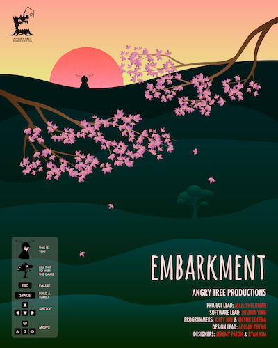
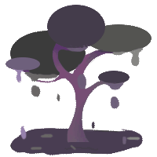
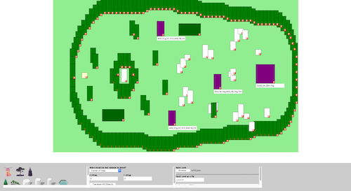
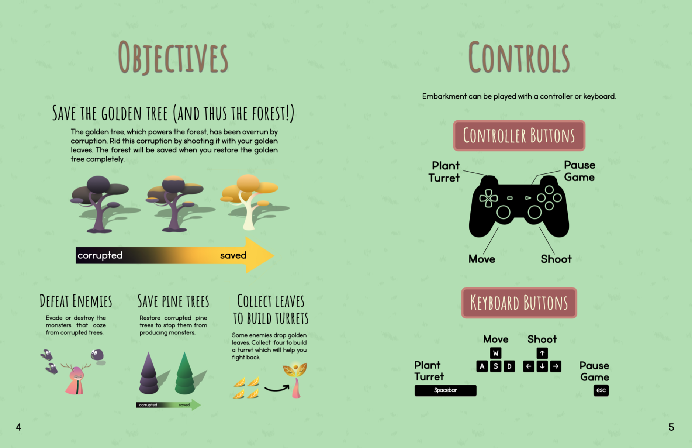
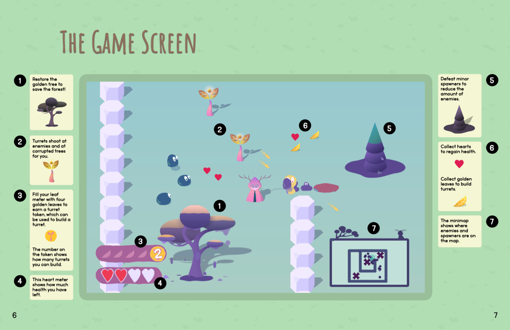

```{python}
# Imports
import yaml
from IPython.display import display, Markdown, HTML
from os import path

import sys
sys.path.append(path.abspath(path.join('..', '..', '..')))
import utils.helpers as h

project_yaml = path.join('..', 'items.yaml')
with open(project_yaml) as f:
    items = yaml.safe_load(f)
    details = [item for item in items if item['id']=='embarkment'][0]
    display(HTML(h.portfolio_item_details(details)))
```

::: {.panel-tabset}

## About

<figure style="float:right;width:50%;min-width:250px;max-width:400px;padding-left:8px;padding-bottom:8px;">

<figcaption>Promotional Poster</figcaption>
</figure>

> Once upon a time...
>
> There was a great forest, where golden trees were said to grow. These golden trees were many in number, and the golden leaves that fell from these trees were believed to bring life and vitality to the forest.
>
> Stories about this place tell of a time when a mysterious, vile corruption swept through the forest, infesting these golden trees. The golden leaves that once gave life now sustained monsters that attacked anything on sight.
>
> If the stories are to be believed, then there must have been a sole hero who rid the forest of this corruption and the monsters lurking within.
>
> The fate of the forest laid on their antlers...

### Teammates & Roles

- <u>Allie Shuldman</u> - Project Lead
- <u>Joshua Ying</u> - Programming Lead, Composer
- <u>Riley Niu</u> - Programmer
- <u>Victor Lucena</u> - Programmer, Composer
- <u>Yueyang Adrian Zheng</u> - Design Lead
- <u>Jeremy Paton</u> - Designer
- <u>Ryan Kim (me)</u> - Designer, Programmer


## Details

### My Roles & Responsibilities

#### Designer

My role was as a designer was to create UI elements, animate sprites, and write promotional material for the game. I primarily used **Photoshop** to animate the sprites. Sprites that I had made and animated include the infected tree sprite and animation, the golden leaf drop sprite and animation, and UI elements such as the menu background and buttons.

<figure style="display:inline-block;width:calc(50%-4px);min-width:100px;max-width:200px;margin-right:4px;margin-bottom:1em;">

<figcaption>Animations for infected trees and plants, in Photoshop</figcaption>
</figure>

<figure style="display:inline-block;width:calc(50%-4px);min-width:100px;max-width:200px;margin-left:4px;margin-bottom:1em;">

<figcaption>Animations for infected trees and plants, in Photoshop</figcaption>
</figure>

#### Programmer

I was also responsible for creating a light version of a level editor that could be used to quickly create maps that could be imported into the game. The light level editor, made with HTML, JavaScript, CSS, and JSON, allows users to place assets in a map, import and export maps, and copy-paste sections of a map onto new areas. The necessity to use this version of the level editor became significant after the full version of the level editor was delayed in development.

<figure style="display:block;width:100%;min-width:200px;max-width:800px;margin:auto;margin-bottom:1em;">

<figcaption>The level editor used to help level designers create maps for the game. This tool is solely meant for internal development and is not made publicly available.</figcaption>
</figure>

#### Other Contributions

I was also responsible for creating the game's manual (which is downloadable alongside the game in the link above). The manual details aspects of gameplay, story, and objectives.

<figure style="display:block;width:100%;min-width:200px;max-width:800px;margin:auto;margin-bottom:1em;">


<figcaption>Select pages of the manual distributed alongside the game</figcaption>
</figure>


## Media

```{python}

content = "<div class='media_grid'>"
content += h.gallery_items(details['media'])
content += "</div>"
display(HTML(content))

```

:::
