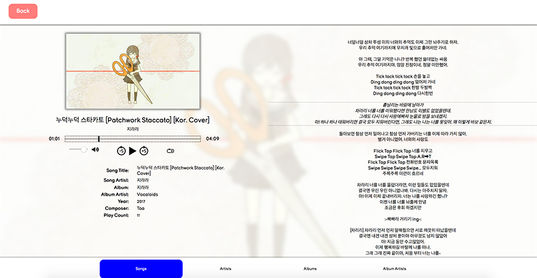

```{python}
# Imports
import yaml
from IPython.display import display, Markdown, HTML
from os import path

import sys
sys.path.append(path.abspath(path.join('..', '..', '..')))
import utils.helpers as h

project_yaml = path.join('..', 'items.yaml')
with open(project_yaml) as f:
    items = yaml.safe_load(f)
    details = [item for item in items if item['id']=='smp'][0]
    display(HTML(h.portfolio_item_details(details, thumbnail_href=None)))
```

::: {.panel-tabset}

## About

The **Simple Music Player**, or **"SMP"** for short, is a fully functional HTML/JavaScript/PHP music player that utilizes a mixture of XML requests and SQLite queries to allow users to play audio and video from their browser. With the help of a SQLite database to store metadata information on each piece of media contained within the music player, data is can be easily accessed without altering the original metadata of all media files.

This project has given the opportunity to investigate how file uploads are processed both through AJAX and XMLHttpRequests(), as well as how JavaScript can be manipulated into playing audio and video. Investigations into how to mimic inheritance within JavaScript have also been permitted based on how the SMP had been designed.

<figure style="width:90%;margin:auto;">

<figcaption>Preview of the Full-Function Music Player's interface</figcaption>
</figure>

### Functionality

- Play audio (mp3) and video (mp4, YouTube embed) media
- Adjust looping and shuffling of albums
- Autoscrolling lyrics
- Media Info Editing, including album art and adding dynamic lyrics

### Features

The SMP can play audio files, video files, and embedded YouTube videos and allows for dynamic subtitles if the user should want so. Additionally, users can add or delete media from the SMP as well, and with the use of a PHP library called the getID3, metadata can be extracted from media \nfiles and stored within the aforementioned database, saving users the effort from inputting all the metadata on their own. Should the need arise, users can also edit details of a piece of media, including uploading specific artwork for that media or use an already-existing artwork already added to the database by other media with artwork.

### Deprecated Prototype: The Full-Function Music Player (FFMP)

The **Full-Function Music Player**, or **"FFMP"** in short, was the basis for the creation of the SMP, which retains much of the same framework as the FFMP with optimized code and additional improvements. The FFMP originally aimed to replicate the functionality of other public music players such as iTunes and Spotify. Users are given the ability to upload individual song files and categorical tags prior to upload (i.e. song title, artist, album artist). Songs can be divided between "Songs", "Artists", "Albums", and "Album Artists" ("Playlists" are not available in this version), which allows for organizing audio based on user preference.

<figure style="width:90%;margin:auto;">

<figcaption>Preview of the Full-Function Music Player's interface</figcaption>
</figure>

## Media

```{python}

content = "<div class='media_grid'>"
content += h.gallery_items(details['media'])
content += "</div>"
display(HTML(content))

```


:::
