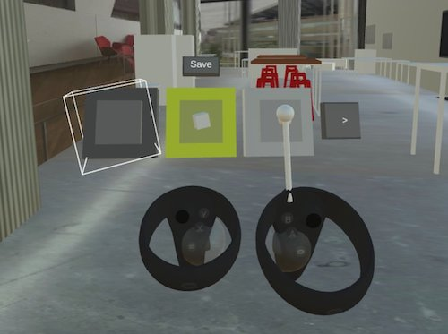
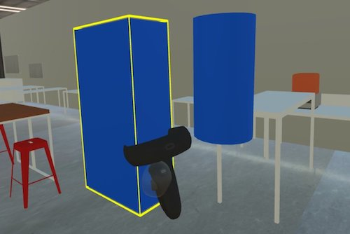
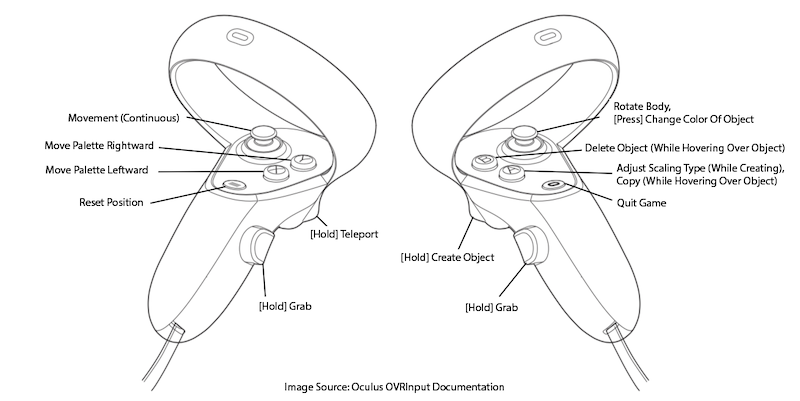
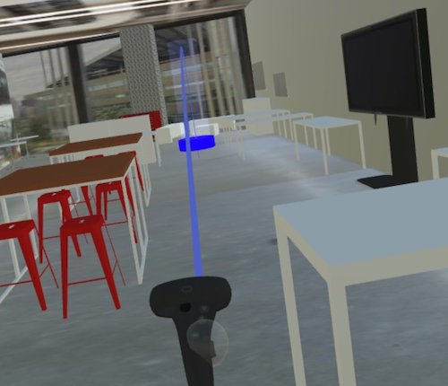
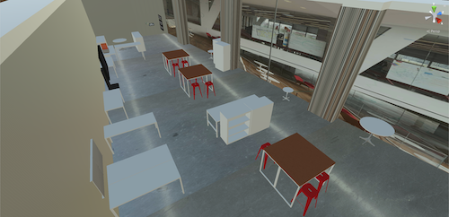

```{python}
# Imports
import yaml
from IPython.display import display, Markdown, HTML
from os import path
import sys

sys.path.append(path.abspath(path.join('..', '..', '..')))
import utils.helpers as h

project_yaml = path.join('..', 'items.yaml')
with open(project_yaml) as f:
    items = yaml.safe_load(f)
    details = [item for item in items if item['id']=='mol'][0]
    display(HTML(h.portfolio_item_details(details)))
```

::: {.panel-tabset}

## About

<iframe src="https://www.youtube.com/embed/8JnFaOgvzcY?si=bCVJNIPVvcfb92wB" title="Project Details: User Interface, Locomotion and Interactions" width="100%" height=315 frameborder=0 allow="accelerometer; autoplay; clipboard-write; encrypted-media; gyroscope; picture-in-picture; web-share" allowfullscreen={true}></iframe>

This paper proposes the idea that 3D object creation can work as a potential method to helping users apply the Method of Loci (MoL) in Virtual Reality (VR). In order to explore this alternative, the paper also introduces a prototype application of a content creator tool that can allow users to instantiate objects within a VR environment easily. Through experimentation with participants in a VR environment, key design issues surrounding this prototype have been made apparent, and thus this paper elaborates on how this content creator tool can be improved for future works. This paper also offers suggestions on how to improve the experiment procedure utilized in this paper and describes key aspects about the MoL technique in VR that should not be ignored.

::::{.callout-note appearance="simple"}

### Download the report here

Download the report here: <a href="./media/iMoL-ir01.pdf" target="_blank">Download PDF (1.6 mB)</a>

::::

## Details

In order to test the efficacy of MoL and offer an experience that improves immersion in VR, a prototype system for content creation has been designed. The prototype system uses a combination of 2D and 3D interaction modalities to provide a user flow that feels comfortable to use. Both the prototype system and the virtual environment are developed with _Unity_ and are playable on the _Oculus Quest_ and _Oculus Rift_.

### Interface Design

The interface of this content creation system utilizes a combination of 2D palette menu and a 3D tooltip. This 2D menu is affixed to a virtual controller corresponding to the user's non-dominant hand, whereas the tooltip is affixed to the virtual controller corresponding to the user's dominant hand. The 2D menu consists of a palette of prefabricated objects, or "prefabs," that the user can select by touching the tooltip of their dominant hand to the palette where the prefabricated object is represented. The palette itself allows for several key functions, such as allowing users to cycle through the list of prefabs available to the user and saving the status of the virtual world for later use should the user decide to leave the virtual world.



The controllers of the Oculus Quest and Rift offer additional buttons and joysticks that are also mapped to other functions of the system. These functions include:

- Continuous movement through the VR environment
- Blink teleportation for users with low tolerance for vection
- Rotation of the player body at 22.5-degree intervals
- Color picker toggle
- Scaling type toggle between the prefab's original scale and the scale defined by the difference between the user's initial tooltip position at the\nstart of the drag and the current position of the tooltip
- Deleting objects in the world
- Cycling through the palette list of prefabs

### Object Instantiation and Manipulation

To instantiate new objects into the world, the user must:

1. Select a prefab from the palette by touching the prefab with the tooltip.
2. Drag the tooltip while holding the index trigger to scale the object prior to placement in the virtual world.
  


Once objects have been instantiated in the world, the user is allowed to manipulate the position and rotation of the object via a grab metaphor with either controller as well as re-color the object via joystick toggle on the dominant hand's controller. Objects cannot be rescaled once they are instantiated in the world. Objects can also be deleted or copied, the functions of which are mapped to buttons on the dominant hand's controller.



### Locomotion

Locomotion within the virtual environment is divided into two subcategories: positioning and rotation. The player avatar in the virtual environment follows the position of the headset using the headset's 6-DOF sensors. Therefore, users can adjust their position in the virtual environment either by moving physically in real-world space or by using the joystick on the non-dominant controller for continuous locomotion. Players can also move around the virtual environment via blink teleportation, which reduces motion sickness from vection as well as reduces the time necessary to navigate across the virtual environment, which was a problem in previous studies involving MoL.



### Environment

The virtual environment was a 3D rendering of Cornell Tech's MakerLab. The virtual environment is populated with renderings of furniture commonly found in the real-world MakerLab such as chairs and tables, and the virtual environment attempts to replicate lighting conditions typically present in the real-world MakerLab. Colliders that match the shape and orientation of the walls, floor, and ceiling prohibit the player avatar from moving outside the test area. The virtual environment was built with and edited using Unity3D, and the game environment runs with Unity's proprietary game engine alongside Oculus' OVR Implementations SDK for VR support.



:::