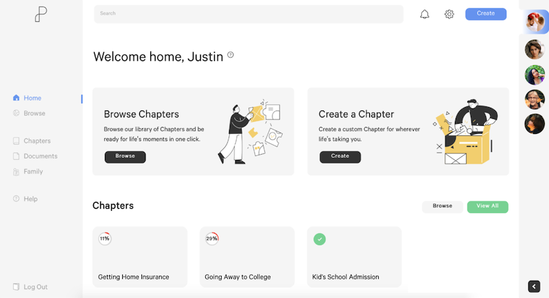
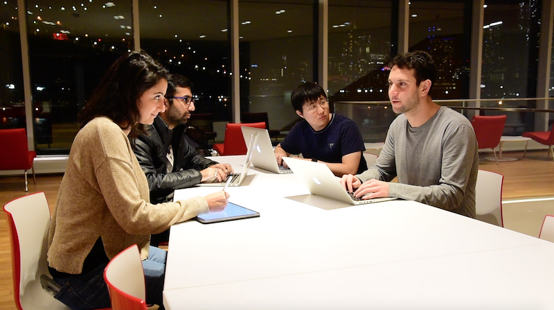

```{python}
# Imports
import yaml
from IPython.display import display, Markdown, HTML
from os import path

import sys
sys.path.append(path.abspath(path.join('..', '..', '..')))
import utils.helpers as h

project_yaml = path.join('..', 'items.yaml')
with open(project_yaml) as f:
    items = yaml.safe_load(f)
    details = [item for item in items if item['id']=='oneplace'][0]
    display(HTML(h.portfolio_item_details(details, thumbnail_href=None)))
```

::: {.panel-tabset}

## About

**"OnePlace"** initially started out as a Startup Studio venture from Cornell Tech between four colleagues, as part of CT's 2019-2020 studio-based master's degree. United by the idea of helping families share important documents online, the four of us wished to ultimately change how families interacted with each other online and how they cooperated to share critical information using the latest web technology.

<figure>

<figcaption>Product UI Preview</figcaption>
</figure>

I joined the project, originally coined "Software for Families," as the lead front-end engineer. I was responsible for designing and building out a user interface that would satisfy both tech-savvy millenials and older potential users who may not be as experienced in web technologies.

It was an interesting challenge and concept, and I quickly grew fond of the idea of engendering positive change by helping families adapt to modern conventions of file-sharing and communication while encouraging safe practices when using the Internet.

<figure>

<figcaption>The Team!</figcaption>
</figure>

### Responsibilities

- **Co-Founder**: Worked together with our teams' leaders on corporate management, team building, and long-term planning.
- **Front-end Engineer**: Worked with our core engineering team to develop a user-friendly user interface and workflow while keeping best practices in security and design theory in mind.
- **Chief Design Officer (CDO)**: Lead the direction of all aspects of the product's functionality and design, from using the design process to guide the team on conceptualizing the User Experience of the product to interacting with our Marketing and Dev Ops teams on ensuring consistency between our external-facing marketing material and our app's capabilities.


## Lessons Learned

### Skills and Experiences Gained:

- Invoking a sprint-driven development cycle of user research + code development gave us the edge we needed to start quickly, given our initial lack of resources.
- Developing a rigorous process of semi-structured user interviews helped to avoid major pitfalls in user research.
- Competitive Analyses of products currently existing in the market gave us a better perspective of why certain products are unable to satisfy niche users and how we could position "OnePlace" to better align with dissatisfied users.
- Delegating tasks to team members based on their strengths and goals tripled our rate of efficiency, motivated each team member to perform, and added a sense of transparency and trust among each other.
- Structuring our design sprints with a distinct process for interview processing, sketching, low-fidelity wireframing, and high-fidelity wireframing helped generate new ideas among team members about how to tackle existing problems and overall allowed us to proceed quickly with our design phase.

### Obstacles:

- Our small number of user interviews risked the possibility of having too few data points to generate key insights from.
- Lack of attention to protocol with user interviews risked the authenticity of our user data.
- Disagreements about team decisions that were collectively agreed upon initially took valuable energy and time away from some of our more important responsibilities and contributed to tensions within our team dynamic.
- The sacrifice of work-life balance in our startup culture risked burnout and stress among our teammates, thereby reducing efficiency and team satisfaction in the long-term.

### General Advice, By Category

The origins of "OnePlace" are mired with both wins and losses, gains and obstacles. This experience has taught me more than any previous job had ever done before about the importance of corporate structure, team-based decision-making, and work-life balance. I came out of the experience with a positive outlook towards the future of the company. While there is no right way to do things, there are certainly wrong ways and avoiding those wrong ways will keep you and your company afloat for much longer than you might expect. Here is a list of suggestions I've created based off of my experiences and the obstacles we faced:

#### Customer Search and User Interviews

- Use either structured or semi-structured interviews with pre-established question lists and topics to ensure that all or most interviews are consistent in their quality. Enforce that quality by using teams of at least two people for your interviews in order to subdivide responsibilities and prevent focus-switching during the interview."
- Avoid common pitfalls in interview questions such as:
    - disguising multiple questions as one single question,
    - asking leading questions to push interviewees towards a certain answer,
    - asking numerous "yes-no" questions instead of more open-ended ones that encourage interviewees to reflect upon their experiences, and
    - using vague language such as "good," "awesome," or "bad" that can be highly interpretive in nature.
- If you are at a phase where you wish to present any designs or wireframes of your product, do so with low-fidelity wireframes if you are early in your design process.

#### User Data Processing - Personas, Empathy Maps, Ethics:

- Try to ensure interviewee privacy and objectiveness by removing indicators of an interviewee's identity from any recordings or notes taken during an interview:
    - Using nicknames or pseudonyms for interviewees is an appropriate measure in this case.
    - Anonymizing user data is key if you need to share insights from your user interviews with 3rd parties who might be interested in your data.
    - Always ensure that you follow rules of consent when it comes to interviewee data. For example, if an interviewee is uncomfortable with using audio recordings, ensure that those wishes are respected.
- Following user interviews, form "Personas" that represent typical members of your target demographics.
    - Your Personas will help be an anchoring point during your sketching and wireframing process.
    - Personas are typically built with the help of methods such as the Empathy Map, which generally help UX teams sort through interviewee data.

#### The Design Process - Sketching and Wireframing:

- The design process typically falls within these phases:
    1. _Sketches_: a collection of rough sketches, usually with pen/paper, the basis for ideation. Can be random and often inconsistent between different sketches, but the purpose is to explore a wide variety of possible ideas.
    2. _Low-Fidelity Wireframes_: a rough outline of what your product will appear like and function as, usually also with pen/paper. These kinds of wireframes are typically used to clarify how your product will work and are often used in user interviews to see if potential users can use your product as expected.
    3. _High-Fidelity Wifeframes_: a clean-up of low-fidelity wireframes, primarily focused on appearance and UI, usually digital.
- The advent of digital tools such as Figma, Canva, and Balsamiq has has made it easy to forego the initial steps of sketching and low-fidelity wireframing. However, there is a significant difference in how users interpret hand-drawn wireframes and digital wireframes:
    - Users typically are MORE critical of hand-drawn wireframes and usually focus on functionality over appearances.
    - Users are typically LESS critical of digital wireframes and usually focus on appearances over functionality in their feedback.
- When testing your product with users via wireframes, use either low-fidelity or high-fidelity wireframes based on this pattern of user behavior.
    - If you are at a phase where you wish to observe how users interpret the potential functionality of your product, use low-fidelity, hand-drawn wireframes.
    - If you are at a phase where you wish to get feedback on the appearance and general UI of your product, use high-fidelity, digital wireframes.

#### Corporate Structure:

- Startups typically require large amounts of dedication from its founders and early employees. Ensure that all founders and employees:
    - are transparent about their expectations, goals, and future roadmaps concerning your company and/or product,
    - adhere to role delegations and keeping each other responsible by keeping note of core responsibilities and tasks delegated to them, and
    - stay on full-time (at least for your founder team), unless the situation demands that a founder or employee work part-time (this is why keeping each other responsible for each person's respective tasks is important).
- Maintain corporate structure by establishing key processes early on and following them in times of uncertainty.
    - It might be tempting to forego corporate structure if you wish to move fast (a necessity for startups), but do not fall into this temptation.
    - Using well-defined, comprehensive contracts and agreements is a must in this regard!


## Media

```{python}

content = "<div class='media_grid'>"
content += h.gallery_items(details['media'])
content += "</div>"
display(HTML(content))

```

:::