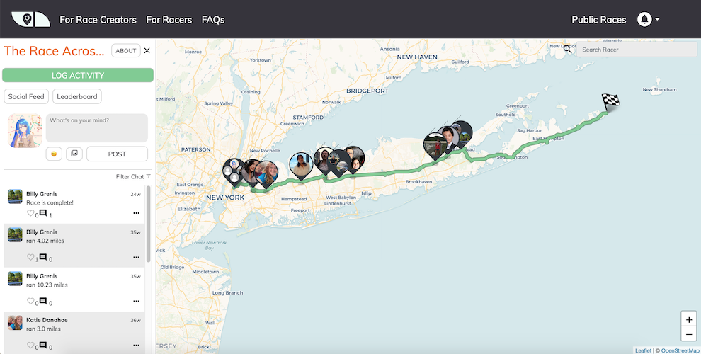
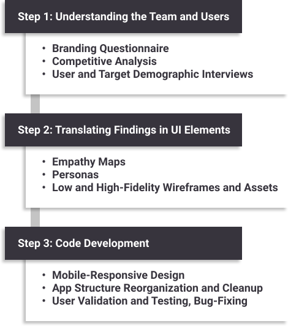
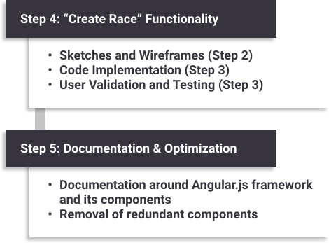
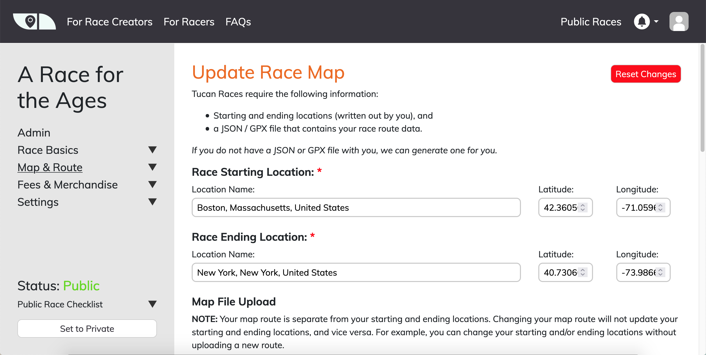

```{python}
# Imports
import yaml
from IPython.display import display, Markdown, HTML
from os import path

import sys
sys.path.append(path.abspath(path.join('..', '..', '..')))
import utils.helpers as h

project_yaml = path.join('..', 'items.yaml')
with open(project_yaml) as f:
    items = yaml.safe_load(f)
    details = [item for item in items if item['id']=='tucan_fitness'][0]
    display(HTML(h.portfolio_item_details(details, thumbnail_href=None)))
```

::: {.panel-tabset}

## About

I was largely responsible for helping the Tucan Fitness front-end development team update their existing user interface and introduce UX Design concepts into their development process.

<figure>

<figcaption>Screenshot of the Tucan Fitness web app user interface.</figcaption>
</figure>

While on this project, I spearheaded the design process by teaching TF's core staff and developers about how to integrate user interview findings into key feature sets. I also acted as the platform's primary front-end developer, working closely together with the team's back-end engineers to add new functions and update outdated processes.

### Responsibilities

- Provide consultation and design suggestions for existing visual elements within the web app.
- Introduce UX Design processes into the development cycle, including the use of empathy maps, personas, wireframes, and brand guidelines.
- Optimize front-end processes to make the app visually consistent and faster.
- Work with back-end engineers to add new functions such as the ability for normal users to create new races.
- Contribute to front-end documentation on the structure and components of the Angular framework.


## Dev Process

Progress in Tucan Fitness during my work period was split into two major stages. The first stage required me to improve the user interface of the Tucan Fitness web application, whereas the second required me to fully create, test, and launch a new collection of screens and functions that would allow normal users to create virtual races of their own.

### Stage 1: UI Updates and Optimization



Crucial to Stage 1 was the introduction of UX Design concepts that would solve a crucial issue: the lack of direction regarding which features to incorporate into the web app. This conundrum came from two distinct issues:

1. Disagreements on how the company should proceed in its design pattern and what features to add.
2. A lack of knowledge on how current users navigated the app and what features they wanted.

The introduction of UX Design processes, from user interviews and brand guideline definitions to empathy maps and personas, solved both of these issues simultaneously. Brand Guidelines, agreed upon by the TF team, centralized which aspects of the UI and functionality that the TF web app would prioritize, while interviews, empathy maps, and personas identified key needs and wants that our target audiences wished to see in the web app.

### Stage 2: "Create Race" Feature & Documentation



By continuously iterating on these interviews and personas within a span of several weeks, similar to an Agile UX process, we were able to update the web app's visual identity and functionality in a way that satisfied a majority of our users.

The insights gained from users, particularly race directors, from Stage 1 also fueled many of the functionalities we added in Stage 2. Our foresight in gathering user interviews from both racers and race directories enabled us to move quickly in code development, for we already had the personas and empathy maps needed to determine which features to add to the "Create Race" part of the web app.

<figure>

<figcaption>Screenshot of the Tucan Fitness web app user interface.</figcaption>
</figure>


### Lessons Learned

While I had provided consultation and development services in the past, this was the first time my consultation extended beyond front-end coding and into UX Design practices. This meant I had to employ different tactics to understand the needs of TF's core team and guide them towards a development process geared towards UX-oriented practices.

Some key takeaways from this experience were:

#### Skills and Experiences Gained:

- Quickly got developers and designers in the team to adapt to UX-specific practices such as empathy maps, personas, and wireframes.
- Became familiar with team leader responsibilities by delegating tasks to appropriate personnel, leading management-level changes in the team's development cycle, and encouraging documentation of front-end code to discover redundancies and disparities in code structure.
- Successfully employed UX Design practices to discover issues in the web app's user experience and identify user needs that were previously undiscovered.

#### Obstacles:

- Remote teamwork often led to a lack of communication and transparency between team members, which sometimes hindered our work ethic.
- A rapid Agile UX design process, while beneficial in identifying user needs and pains, sometimes moved too quickly to allow for group collaboration on code, instead forcing one or two developers to spearhead changes and preventing the team from documenting changes. This could have been avoided through careful note taking during both meetings and development scrums to provide overviews on progress and upcoming tasks.
- Code documentation was neglected for much of the process until much later in the development cycle.


:::